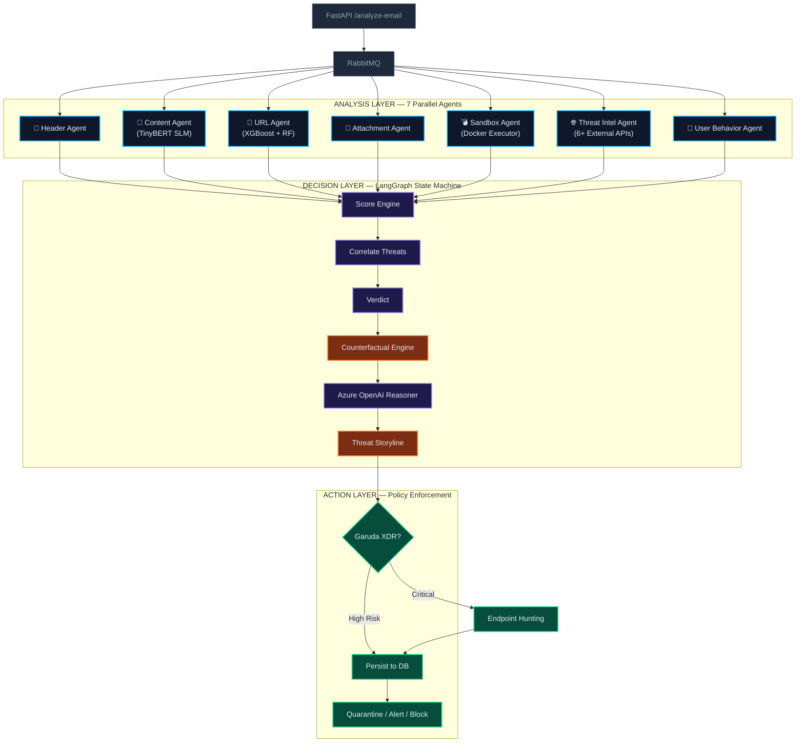
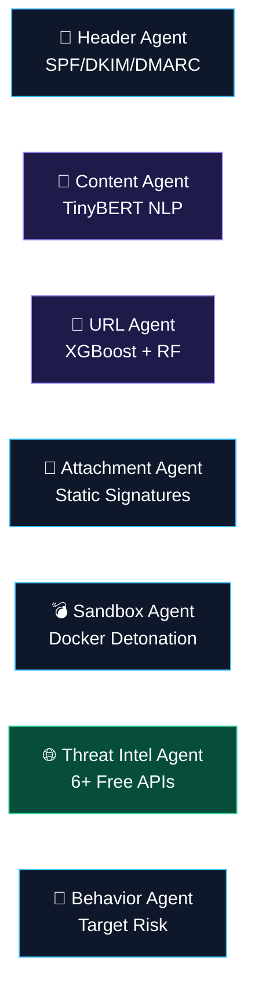
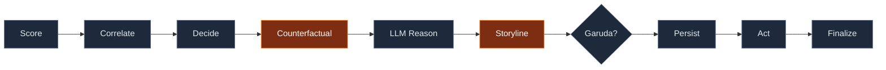

# ⬡ Agentic AI Email Security System

> Production-grade, multi-agent email security platform for phishing and malware defense with parallel analysis, deterministic orchestration, counterfactual explainability, and attack storyline timelines.

[](#)
[](#)
[](#)
[](#)
[](#license)

---

## Table of Contents

| Section | Description |
|---|---|
| [Quick Start](#-quick-start) | Get running in 3 steps |
| [Architecture](#-system-architecture) | Three-layer pipeline with Mermaid diagrams |
| [Security Agents](#-security-agents) | 7 parallel AI analyzers |
| [Decision Pipeline](#-decision-pipeline) | LangGraph orchestration flow |
| [Explainability](#-explainability-features) | Counterfactual engine + storyline + LLM |
| [API Reference](#-api-reference) | All endpoints at a glance |
| [SOC Frontend](#-soc-frontend) | Web-based analyst interface |
| [Configuration](#%EF%B8%8F-configuration) | Environment variables and settings |
| [Testing](#-testing) | Test suite and quality checks |
| [Project Structure](#-project-structure) | Directory layout |
| [Technology Stack](#-technology-stack) | Core technologies used |

---

## 🚀 Quick Start

### Option A — Docker (recommended for full pipeline)

```bash
cd docker
docker compose up --build
```

### Option B — Local Dev Mode

```bash
# 1. Create and activate virtual environment
python3 -m venv venv
source venv/bin/activate

# 2. Install dependencies
pip install -r requirements.txt
cp .env.template .env        # Edit .env with your settings

# 3. Start the API server
uvicorn email_security.api.main:app --reload --host 0.0.0.0 --port 8000
```

### Open Interfaces

| Interface | URL |
|---|---|
| 📊 SOC Frontend | `http://localhost:8000/ui` |
| ⬆ Email Analysis | `http://localhost:8000/ui/analyze` |
| 🧪 Agent Testing | `http://localhost:8000/ui/agents` |
| 📄 Swagger Docs | `http://localhost:8000/docs` |

### How to Use the Frontend

1. Start your backend with `uvicorn email_security.api.main:app --host 0.0.0.0 --port 8000`
2. Open `http://localhost:8000/ui` in your browser
3. **Settings (top-right ⚙):** Only needed if your backend `.env` has `API_AUTH_ENABLED=1`. For local development, **leave it blank** — no key is required!
4. Navigate to **Analyze** → drag & drop a `.eml` / `.msg` / `.txt` file → watch the full pipeline execute
5. Navigate to **Agents** → select any agent → insert custom text, URLs, or headers → run isolated tests
6. All results render in structured views with raw JSON toggle

---

## 🏗 System Architecture

### High-Level Overview



### Three Layers Explained

| Layer | Role | Key Component |
|---|---|---|
| **Analysis** | 7 parallel agents simultaneously evaluate different email dimensions | `agents/` |
| **Decision** | LangGraph state machine — scoring, correlation, explainability, verdict | `orchestrator/` |
| **Action** | Policy enforcement — quarantine, SOC alert, block, Garuda bridge | `action_layer/` |

---

## 🔬 Security Agents

### Agent Details



| Agent | Model / Method | External APIs | What It Does |
|---|---|---|---|
| 📧 `header_agent` | Deterministic rules | — | SPF/DKIM/DMARC validation, spoofing detection, routing anomaly checks |
| 🧠 `content_agent` | **TinyBERT SLM** | — | NLP-based phishing intent detection over sanitized email body text |
| 🔗 `url_agent` | **XGBoost + Random Forest** | — | Lexical heuristic + ML ensemble scoring of embedded URLs |
| 📎 `attachment_agent` | Static analysis rules | — | File metadata, signature, and feature inspection without execution |
| 💣 `sandbox_agent` | Docker executor + behavior rules | — | Dynamic file detonation in isolated containers; monitors network/file activity |
| 🌐 `threat_intel_agent` | Local IOC DB + feed correlation | VirusTotal, OTX, URLhaus, AbuseIPDB, Google Safe Browsing, OpenPhish | Cross-references all observables against 6+ global threat databases |
| 👤 `user_behavior_agent` | Context-aware scoring | — | Recipient susceptibility and target-specific risk amplification |

---

## ⚙ Decision Pipeline

The LangGraph state machine processes the email through a strict node sequence:



| Node | Purpose |
|---|---|
| **Score** | Weighted normalization of all 7 agent risk outputs into a single `0.0–1.0` score |
| **Correlate** | Cross-agent correlation bumps (e.g., malicious URL + urgent content = amplified risk) |
| **Decide** | Verdict selection: `safe`, `suspicious`, `high_risk`, or `malicious` |
| **Counterfactual** | ⭐ Finds the minimum agent change to flip the verdict across a policy boundary |
| **LLM Reason** | Azure OpenAI generates analyst-readable investigation summary (with deterministic fallback) |
| **Storyline** | ⭐ Maps indicators into chronological Delivery → Lure → Weaponization → Containment phases |
| **Garuda** | Conditional: triggers endpoint threat hunting if risk exceeds critical threshold |
| **Persist** | Stores report to database with all analysis artifacts |
| **Act** | Dispatches policy actions: quarantine, SOC alert, block sender |

---

## 🧩 Explainability Features

### Counterfactual Engine

> *"This email was blocked. However, if the URL Agent score dropped below 0.3, the verdict would flip to safe."*

- Uses verdict-aware thresholds (`malicious ≥ 0.8`, `high_risk ≥ 0.6`, `suspicious ≥ 0.4`)
- Applies bounded confidence-aware attenuation (realistic perturbation, not zero-masking)
- Returns the **minimum set of agent outputs** needed to shift the verdict across a boundary

### Threat Storyline Timeline

Converts disconnected agent indicators into a chronological attack narrative:

| Phase | Maps From | Purpose |
|---|---|---|
| **Delivery** | header_agent | Attacker infrastructure and sender setup |
| **Lure** | content_agent | Social engineering intent and bait techniques |
| **Weaponization** | url_agent, attachment_agent, sandbox_agent | URL/attachment payload behavior |
| **Containment** | verdict + actions | Policy verdict and enforced response |

Each phase includes `severity`, `confidence`, and ATT&CK-like tactic tags.

### LLM SOC Reasoning

- Azure OpenAI generates concise, analyst-friendly investigation summaries
- Counterfactual boundaries are injected into the prompt for mathematically-grounded explanations
- Deterministic fallback explanation used when LLM is unavailable

---

## 📡 API Reference

### Core Analysis

| Method | Endpoint | Description |
|---|---|---|
| `GET` | `/health` | Service health check |
| `POST` | `/analyze-email` | Ingest structured email payload for async analysis |
| `POST` | `/ingest-raw-email` | Upload raw `.eml/.msg/.txt` → parse + publish |
| `GET` | `/reports/{analysis_id}` | Fetch finalized report |

### SOC & Operations

| Method | Endpoint | Description |
|---|---|---|
| `GET` | `/soc/dashboard` | HTML analyst dashboard |
| `GET` | `/soc/overview` | Queue + verdict + action summary JSON |
| `POST` | `/ops/garuda/process-retries` | Process Garuda retry queue |
| `GET` | `/ops/threat-intel/status` | IOC lifecycle and policy health |
| `POST` | `/ops/threat-intel/refresh` | Force IOC refresh |

### Agent Testing (Isolated)

| Method | Endpoint | Description |
|---|---|---|
| `GET` | `/agent-test/agents` | List testable agents |
| `GET` | `/agent-test/examples` | Sample payload templates |
| `POST` | `/agent-test/{agent_name}` | Run single agent with custom payload |

> **Safety:** Direct testing **bypasses** RabbitMQ, orchestrator, and action layer. Production flow is never affected.

### Frontend

| Method | Endpoint | Description |
|---|---|---|
| `GET` | `/ui` | SOC overview dashboard |
| `GET` | `/ui/analyze` | File upload analysis page |
| `GET` | `/ui/agents` | Individual agent testing page |

---

## 🖥 SOC Frontend

Built-in web interface served directly from the FastAPI application — zero additional setup required.

| Page | Path | Purpose |
|---|---|---|
| **Overview** | `/ui` | Feature showcase, pipeline visualization, tech badges, live SOC metrics |
| **Analyze** | `/ui/analyze` | Drag-and-drop email upload → full pipeline → structured report |
| **Agents** | `/ui/agents` | Select agent → edit/load payload → run isolated test → view output |

**Design:**
- Dark glassmorphism theme with subtle grid background and micro-animations
- Pipeline visualization showing the full LangGraph node sequence
- Agent feature cards with technology tags (ML, API, Unique)
- Structured result rendering with raw JSON toggle
- Settings dropdown *only needed if `API_AUTH_ENABLED=1`* — leave blank for local dev

---

## ⚙️ Configuration

All settings are environment-driven via `.env` and `configs/settings.py`.

| Group | Key Variables |
|---|---|
| **App & Runtime** | `APP_ENV`, `APP_LOG_LEVEL`, `APP_DEBUG` |
| **API Auth** | `API_AUTH_ENABLED`, `API_AUTH_KEY` |
| **Message Bus** | `RABBITMQ_HOST`, `RABBITMQ_PORT`, `RABBITMQ_USER`, `RABBITMQ_PASSWORD` |
| **Persistence** | `DATABASE_URL`, `REDIS_URL` |
| **Models** | `HEADER_MODEL_PATH`, `CONTENT_MODEL_PATH`, `URL_MODEL_PATH`, etc. |
| **Threat Intel** | `ENABLE_VIRUSTOTAL_URL_LOOKUP`, `ENABLE_GOOGLE_SAFE_BROWSING_LOOKUP`, etc. |
| **IOC Lifecycle** | `IOC_REFRESH_SECONDS`, `IOC_STALE_SECONDS`, `IOC_MIN_RECORDS` |
| **Sandbox** | `SANDBOX_LOCAL_DOCKER_ENABLED`, `SANDBOX_EXECUTOR_URL`, `SANDBOX_TIMEOUT_SECONDS` |
| **Action Layer** | `ACTION_SIMULATED_MODE`, `QUARANTINE_API_URL`, `SOC_ALERT_API_URL` |

> Copy `.env.template` to `.env` and edit values for your environment.

---

## 🧪 Testing

```bash
# Run full test suite
pytest -q

# Run with verbose output
pytest -v

# Run specific test
pytest tests/test_counterfactual.py -v
pytest tests/test_storyline.py -v
```

Test coverage includes:
- Agent wiring consistency and direct test API endpoints
- Orchestrator flow (LangGraph pipeline, partial finalization)
- Counterfactual engine boundary detection
- Storyline engine phase mapping
- Sandbox safety and isolation hardening
- Threat intel health policy and external enrichment
- Email parser capabilities
- Bootstrap config validation

---

## 📁 Project Structure

```
email_security/
├── agents/                      # 7 independent security agents
│   ├── header_agent/
│   ├── content_agent/
│   ├── url_agent/
│   ├── attachment_agent/
│   ├── sandbox_agent/
│   ├── threat_intel_agent/
│   ├── user_behavior_agent/
│   └── service_runner.py        # Agent function registry
├── orchestrator/                # Decision layer
│   ├── langgraph_workflow.py    # LangGraph state machine
│   ├── langgraph_state.py       # Shared state schema
│   ├── scoring_engine/          # Weighted risk scoring
│   ├── threat_correlation/      # Cross-agent correlation
│   ├── decision_engine/         # Verdict selection
│   ├── counterfactual_engine.py # ⭐ Boundary explainability
│   ├── storyline_engine.py      # ⭐ Attack timeline
│   └── llm_reasoner.py          # Azure OpenAI reasoning
├── action_layer/                # Response enforcement
│   └── response_engine.py
├── api/                         # FastAPI application
│   ├── frontend/                # SOC web interface (HTML/CSS/JS)
│   ├── main.py                  # Endpoints and routing
│   └── schemas.py               # Pydantic models
├── services/                    # Shared services
├── configs/                     # Settings and environment
├── preprocessing/               # Data preprocessing
├── sandbox/                     # Sandbox infrastructure
├── garuda_integration/          # Endpoint hunting bridge
├── docker/                      # Docker Compose setup
├── tests/                       # Pytest test suite
├── scripts/                     # Utility scripts
├── models/                      # Trained model artifacts
├── data/                        # IOC stores and data
├── datasets/                    # Raw training datasets
├── datasets_processed/          # Processed datasets
├── docs/                        # Additional documentation
└── requirements.txt             # Python dependencies
```

---

## 🔧 Technology Stack

| Category | Technologies |
|---|---|
| **API** | FastAPI, Uvicorn |
| **Orchestration** | LangGraph |
| **Queue** | RabbitMQ |
| **Cache** | Redis |
| **Database** | PostgreSQL |
| **LLM Reasoning** | Azure OpenAI |
| **ML** | Transformers (TinyBERT), scikit-learn, XGBoost, LightGBM |
| **Logging** | Loguru |
| **Config** | Pydantic Settings, python-dotenv |
| **Containers** | Docker, Docker Compose |

---

## 📜 License

This project is proprietary. All rights reserved.
