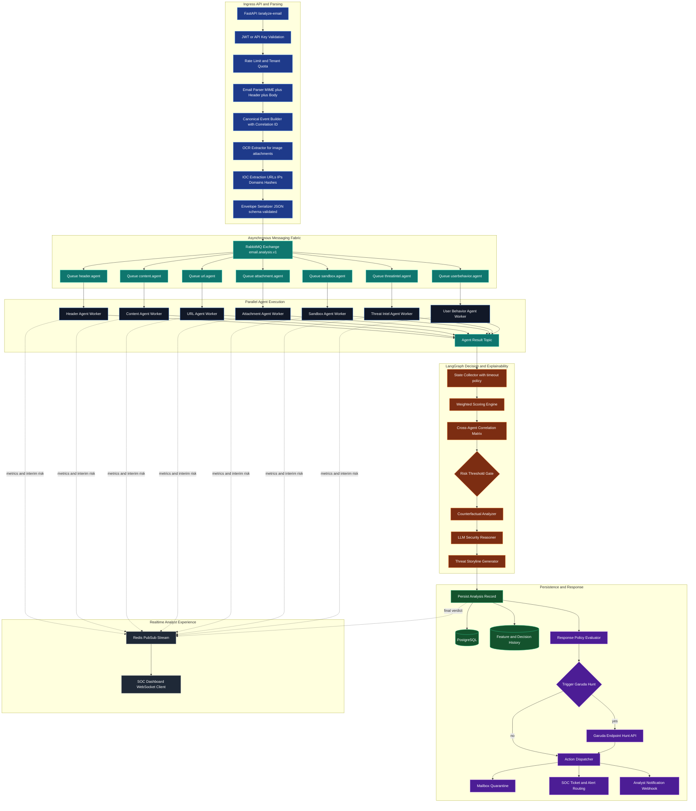
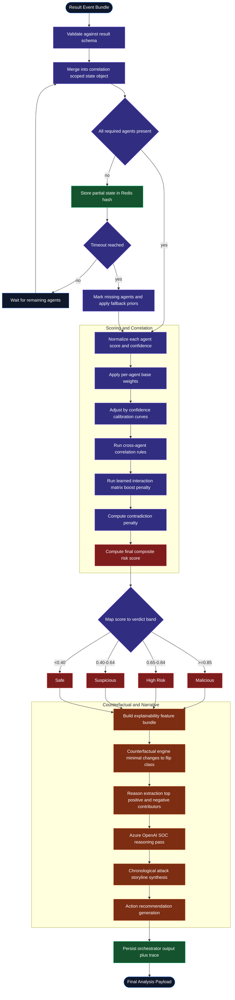
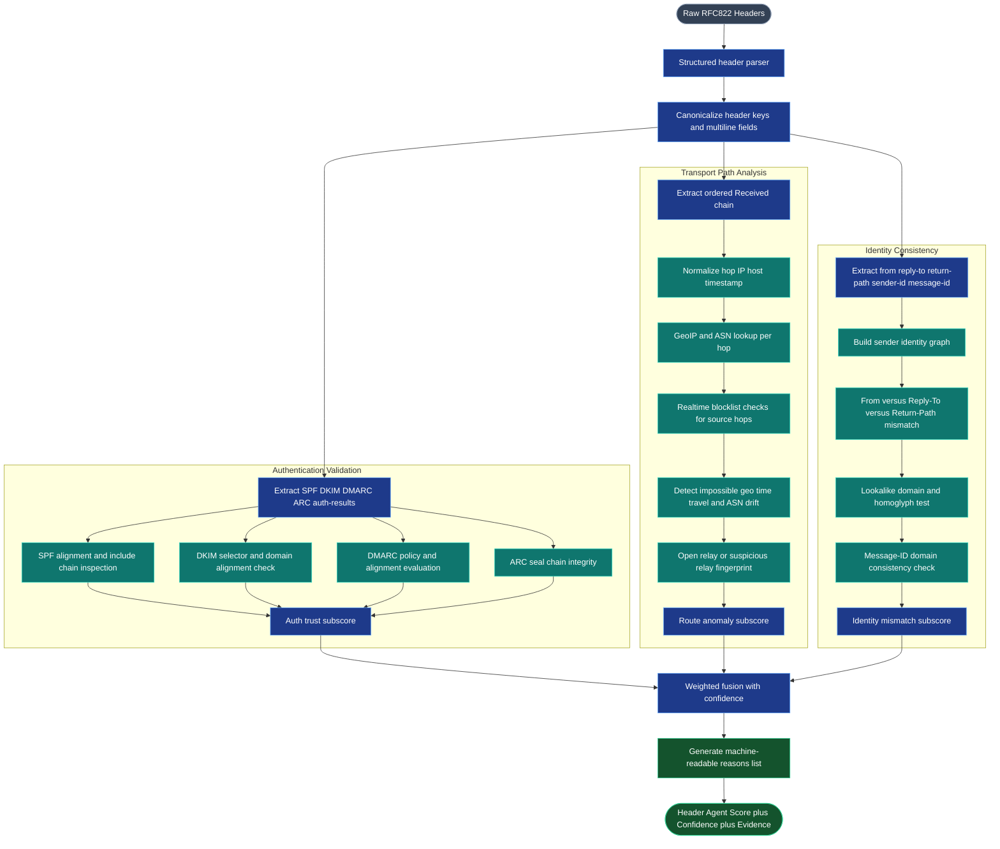
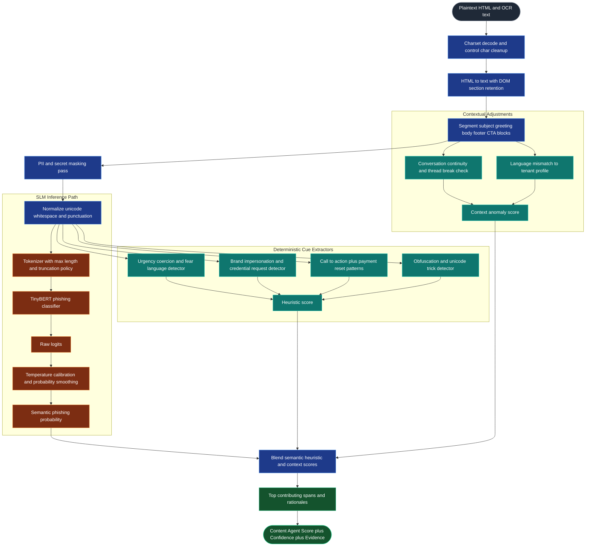
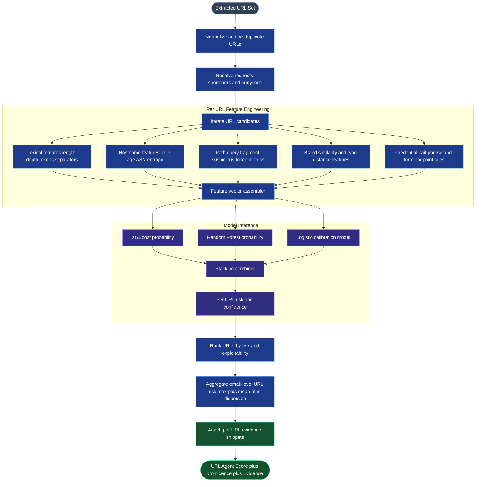
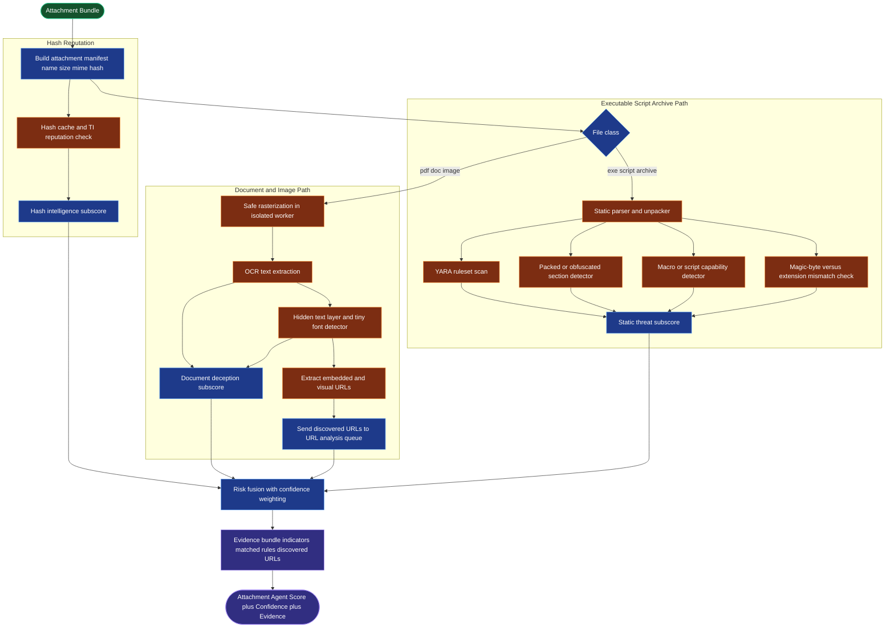
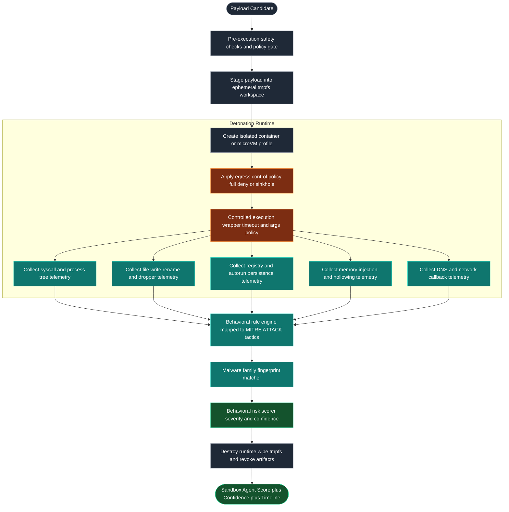
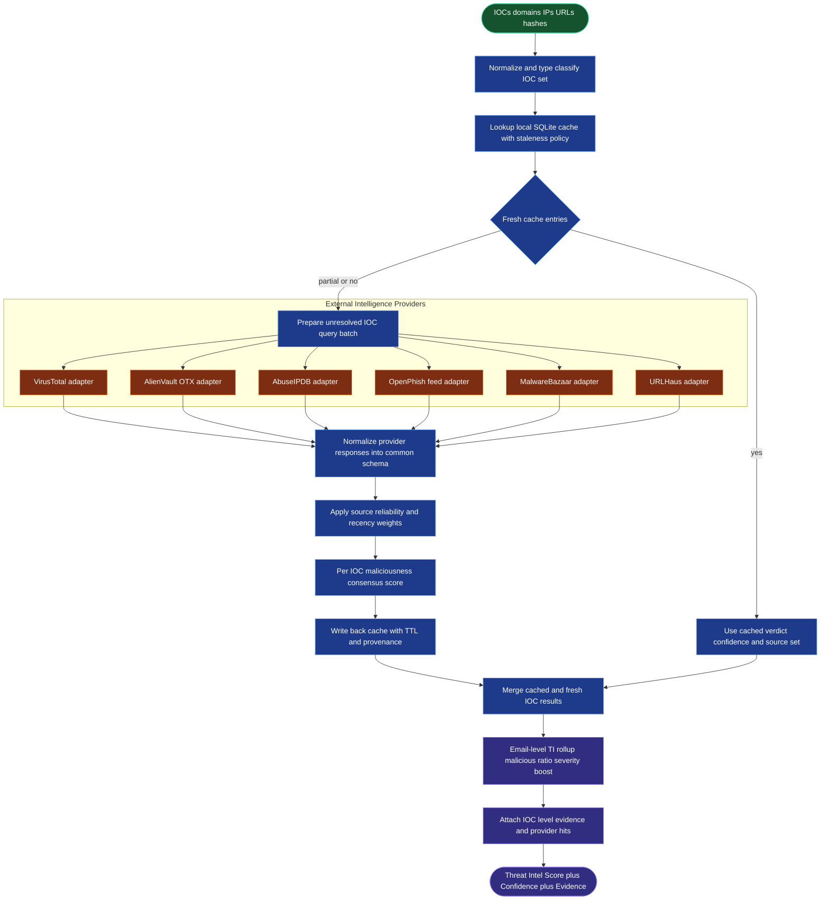
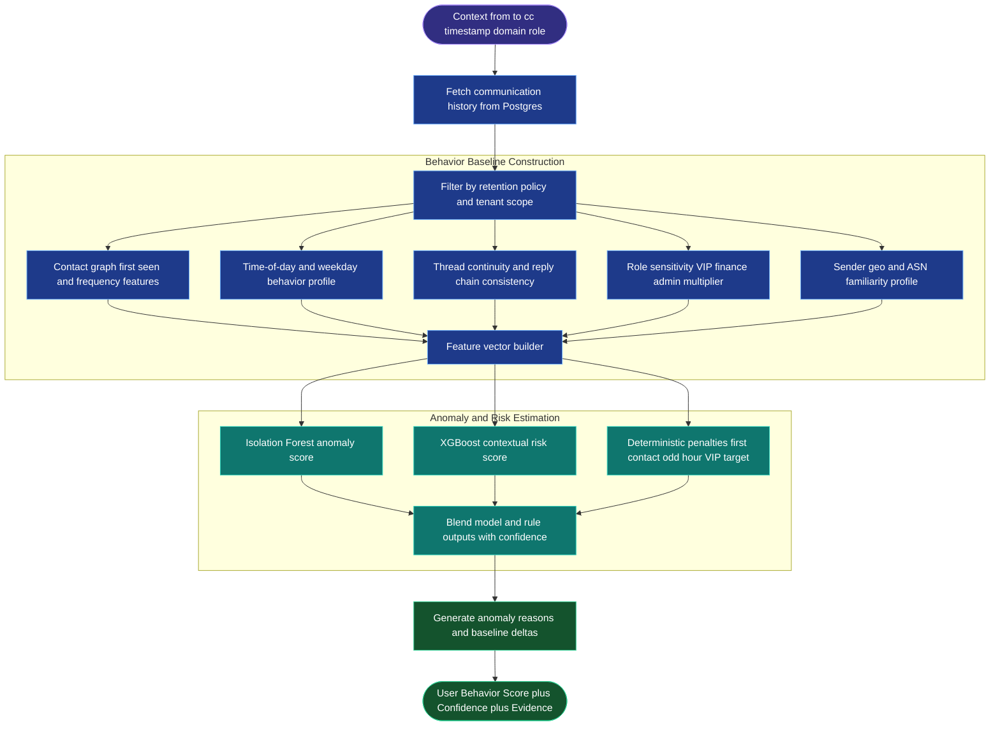

# Detailed Agentic System Architecture

This document maps the full end-to-end architecture and provides deep internal flow diagrams for every analytical agent and the LangGraph decision layer.

---

## 0. Overall System Architecture

This graph shows the complete data plane and control plane from API ingress to final action dispatch.

---

## 1. Decision Layer (LangGraph Orchestrator)

The orchestrator is modeled as a state graph with strict transitions, timeout handling, and explainability stages.

---

## 2. Header Agent Architecture

Detects identity spoofing and transport anomalies from the full transit path.

---

## 3. Content Agent Architecture

Runs privacy-safe semantic phishing detection over cleaned body text and structural cues.

---

## 4. URL Agent Architecture

Performs canonicalization, lexical feature engineering, model ensemble scoring, and campaign-level aggregation.

---

## 5. Attachment and OCR Agent Architecture

Combines static file triage, safe extraction, OCR analysis, and URL re-injection for hidden-link detection.

---

## 6. Sandbox Agent Architecture

Detonates suspicious artifacts in isolated runtime with behavioral telemetry and kill-chain mapping.

---

## 7. Threat Intel Agent Architecture

Performs cache-first IOC enrichment with provider fan-out, normalization, reliability weighting, and verdict synthesis.

---

## 8. User Behavior Agent Architecture

Builds recipient and sender interaction baselines, detects anomalies, and computes contextual risk uplift.

